## Sobre mim

Desenvolvedor focado em soluções práticas e bem estruturadas, com experiência em **JavaScript**, **TypeScript**, **Node.js** e automação de sistemas.

## Tecnologias

## Estatísticas

<picture>
  <source media="(prefers-color-scheme: dark)" srcset="https://github-profile-summary-cards.vercel.app/api/cards/stats?username=HaraYon&theme=github_dark" />
  <source media="(prefers-color-scheme: light)" srcset="https://github-profile-summary-cards.vercel.app/api/cards/stats?username=HaraYon&theme=github" />
  
</picture>

<picture>
  <source media="(prefers-color-scheme: dark)" srcset="https://github-profile-summary-cards.vercel.app/api/cards/repos-per-language?username=HaraYon&theme=github_dark" />
  <source media="(prefers-color-scheme: light)" srcset="https://github-profile-summary-cards.vercel.app/api/cards/repos-per-language?username=HaraYon&theme=github" />
  
</picture>

## Contribuições

<picture>
  <source media="(prefers-color-scheme: dark)" srcset="https://github-readme-activity-graph.vercel.app/graph?username=HaraYon&theme=github-compact&hide_border=true&area=true" />
  <source media="(prefers-color-scheme: light)" srcset="https://github-readme-activity-graph.vercel.app/graph?username=HaraYon&theme=github-light&hide_border=true&area=true" />
  
</picture>

## Projetos em destaque

| Projeto | Descrição | Stack |
| :--- | :--- | :--- |
| [**Bots**](https://github.com/HaraYon/Bots) | Bot para Discord focado em automação, organização e engajamento, com arquitetura limpa e fácil de expandir. | TypeScript |
| [**MelMelbot**](https://github.com/HaraYon/MelMelbot) | Bot para Discord construído com Discord.js v14 e Components V2. | JavaScript · Discord.js |

## Contato

---

  Construindo com clareza, organização e propósito.

