## Sobre mim

Desenvolvedor de software focado em transformar necessidades reais em soluções práticas, organizadas e fáceis de evoluir. Trabalho principalmente com **JavaScript**, **TypeScript** e **Node.js**, criando automações, integrações e aplicações para comunidades digitais.

Também desenvolvo projetos com **React** e **Python**, sempre buscando código claro, boa estrutura e manutenção simples. Tenho interesse especial em **arquitetura de software**, **automação** e **segurança**.

## Projetos em destaque

### [Bots](https://github.com/HaraYon/Bots)

Bot para Discord focado em automação, organização e engajamento. O projeto utiliza **TypeScript** e possui uma estrutura preparada para receber novos recursos.

[Ver repositório →](https://github.com/HaraYon/Bots)

### [MelMelbot](https://github.com/HaraYon/MelMelbot)

Bot para Discord desenvolvido com **JavaScript**, **Discord.js v14** e **Components V2**, com uma interface moderna e recursos voltados à interação entre membros da comunidade.

[Ver repositório →](https://github.com/HaraYon/MelMelbot)

## Tecnologias

## GitHub em números

<picture>
  <source media="(prefers-color-scheme: dark)" srcset="https://github-profile-summary-cards.vercel.app/api/cards/stats?username=HaraYon&theme=github_dark" />
  <source media="(prefers-color-scheme: light)" srcset="https://github-profile-summary-cards.vercel.app/api/cards/stats?username=HaraYon&theme=github" />
  
</picture>

<picture>
  <source media="(prefers-color-scheme: dark)" srcset="https://github-profile-summary-cards.vercel.app/api/cards/repos-per-language?username=HaraYon&theme=github_dark" />
  <source media="(prefers-color-scheme: light)" srcset="https://github-profile-summary-cards.vercel.app/api/cards/repos-per-language?username=HaraYon&theme=github" />
  
</picture>

## Atividade

<picture>
  <source media="(prefers-color-scheme: dark)" srcset="https://github-readme-activity-graph.vercel.app/graph?username=HaraYon&theme=github-compact&hide_border=true&area=true" />
  <source media="(prefers-color-scheme: light)" srcset="https://github-readme-activity-graph.vercel.app/graph?username=HaraYon&theme=github-light&hide_border=true&area=true" />
  
</picture>

## Contato

---

  Construindo com clareza, organização e propósito.

